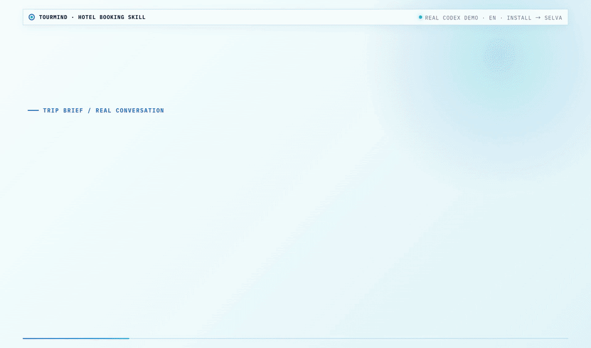
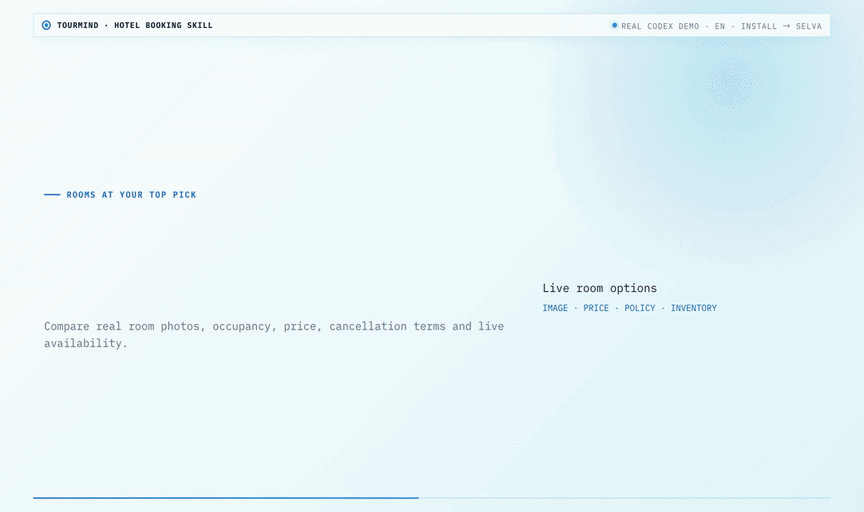
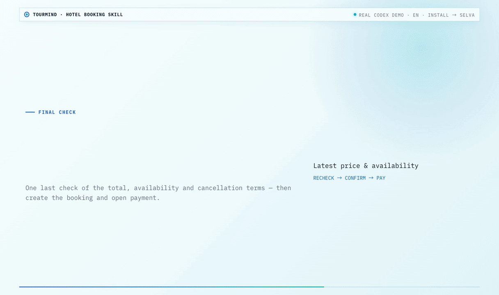

# Skill de reservas de hotel de TourMind

[English](README.md) | [简体中文](README.zh-CN.md) | [日本語](README.ja.md) | [Español](README.es.md)

Convierte cualquier agente de IA en un asistente integral de reservas de hotel: busca inventario global, compara tarifas en tiempo real entre las principales OTA y proveedores hoteleros, verifica disponibilidad y completa reservas, pagos, cancelaciones y gestión de pedidos en una sola conversación con TourMind.

## Demostración

### 1. Buscar hoteles en tiempo real



### 2. Comparar habitaciones reales



### 3. Verificar la tarifa final y pagar



## Capacidades principales

- Resuelve ciudades, hoteles, lugares de interés, estaciones, direcciones, zonas de esquí y otros POI sin inventar coordenadas.
- Busca hasta 20 hoteles candidatos, consulta productos de habitación en tiempo real y selecciona las cinco mejores opciones verificadas.
- Compara tarifas por noche y totales de estancia entre las principales OTA y proveedores hoteleros, junto con cancelación y estado del inventario.
- Devuelve imágenes de hoteles y habitaciones, instalaciones, camas, comidas, cargos y motivos de selección basados en datos.
- Vuelve a verificar el precio y la disponibilidad de la habitación elegida antes de reservar.
- Crea reservas, consulta y cancela pedidos e inicia pagos con Stripe, WeChat Pay o Alipay.
- Proporciona enlaces de resultados de solo lectura, reutilizables hasta su vencimiento, sin exponer el Skill Token.

## Clientes de IA compatibles

| Cliente | Compatibilidad |
|---|---|
| WorkBuddy | Instala o importa este repositorio como Skill de usuario |
| OpenAI Codex | Instala desde la interfaz de Skills o un directorio local compatible con tu versión |
| Claude Code | Instala como Skill personal en `~/.claude/skills` |
| Clientes compatibles con Agent Skills | Compatible cuando el cliente puede cargar un `SKILL.md` en la raíz y realizar solicitudes HTTPS `POST` |
| Clientes de IA compatibles con MCP | Utiliza el paquete complementario [TourMind Booking MCP](https://github.com/tourmind-com/Tourmind-Booking-MCP) |

## Instalación en 1 minuto

1. Genera un Skill Token en [tourmind.com/user/skill-token](https://tourmind.com/user/skill-token).

2. En la interfaz de Skills de tu cliente de IA, instala o importa este repositorio de GitHub:

   ```text
   https://github.com/tourmind-com/Tourmind-Booking-Skill.git
   ```

   Si el cliente carga Skills desde el sistema de archivos, clona el repositorio en su directorio de Skills personales:

   ```bash
   CLIENT_SKILLS_DIR="<directorio-de-skills-del-cliente>"
   mkdir -p "$CLIENT_SKILLS_DIR"
   git clone https://github.com/tourmind-com/Tourmind-Booking-Skill.git "$CLIENT_SKILLS_DIR/tourmind-booking"
   ```

   Directorios personales habituales:

   | Cliente | Directorio |
   |---|---|
   | WorkBuddy | `~/.workbuddy/skills` |
   | OpenAI Codex | Usa la interfaz de Skills o el directorio local compatible con tu versión de Codex |
   | Claude Code | `~/.claude/skills` |

3. En la carpeta `tourmind-booking` instalada, crea `skill_token.txt` y pega únicamente el Token original. En macOS o Linux, restringe el acceso:

   ```bash
   chmod 600 skill_token.txt
   ```

Recarga los Skills o reinicia el cliente de IA y solicita un hotel. No se necesita un servidor MCP local; este Skill llama directamente a la API de TourMind mediante HTTPS.

Nunca confirmes `skill_token.txt` en Git. El archivo está excluido por `.gitignore`.

## Prompts de ejemplo

Estos ejemplos combinan la investigación y planificación de itinerarios del propio agente con la búsqueda de hoteles, verificación de tarifas, reserva, pago y gestión de pedidos en tiempo real de TourMind.

```text
Estoy planeando un viaje de cuatro noches para dos personas a Osaka (Japón), del 9 al 13 de abril de 2027, con llegada y salida por el Aeropuerto Internacional de Kansai. Queremos dedicar uno o dos días a la pesca en el mar en la bahía de Osaka o cerca de la isla de Awaji y no alquilaremos coche. Primero utiliza tus propias capacidades de investigación web y planificación para comparar zonas de pesca prácticas, condiciones de temporada, opciones legales de barco chárter o pesca compartida y tiempos de transporte público; después propón un itinerario diario relajado. Para la mejor base, usa TourMind para buscar inventario hotelero en tiempo real. Mantén el precio medio por debajo de 18.000 JPY por noche y prioriza una habitación con dos camas, cerca de una estación, con transporte práctico al punto de encuentro de pesca a primera hora, cancelación gratuita y desayuno cuando sea compatible con la hora de salida. Muestra las cinco mejores opciones verificadas con fotos de la habitación, precio total y moneda, impuestos y cargos cuando se devuelvan, condiciones de cancelación, desayuno, traslado al punto de pesca, ventajas e inconvenientes y un enlace de resultados que pueda abrirse varias veces. No reserves todavía.
```

```text
Planifica un viaje de esquí de seis noches a los Dolomitas (Dolomites), Italia, para dos adultos, del 6 al 12 de febrero de 2027. Llegaremos al aeropuerto Marco Polo de Venecia, no conduciremos y tenemos nivel intermedio. Primero compara Cortina d’Ampezzo, Val Gardena y Alta Badia por traslado desde el aeropuerto, terreno esquiable, gastronomía y relación calidad-precio; después recomienda la mejor base y un plan diario realista. Usa TourMind para buscar hoteles disponibles con una media máxima de 250 EUR por noche, preferiblemente a menos de 10 minutos a pie o en lanzadera de un remonte, con guardaesquís, desayuno, cancelación gratuita y sauna si es posible. Devuelve las cinco mejores opciones verificadas en tiempo real con tipo de habitación y cama, fotos, precio por noche y total, plazos de cancelación, comidas, estado del inventario, distancia al remonte y cualquier requisito que no cumplan. Cuando elija una, vuelve a verificar su precio y disponibilidad, resume el importe final exacto y las condiciones, y espera mi confirmación explícita antes de reservar o iniciar el pago.
```

```text
Usa el segundo hotel de la comparación. Muestra sus detalles y todos los productos de habitación actualmente reservables para dos adultos, incluidas fotos, tipo de cama, comidas, política de cancelación, si está sujeto a petición, precio por noche y precio total. Recomienda la tarifa con mejor relación calidad-precio y explica por qué; después vuelve a verificar esa tarifa exacta. Si algo ha cambiado, muestra claramente los valores anteriores y nuevos. Si no hay cambios, presenta el resumen final de la reserva y pide mi confirmación. No crees la reserva ni inicies el pago hasta que diga explícitamente «confirmar reserva».
```

```text
Consulta mi reserva con el identificador de referencia del agente <AGENT_REF_ID> y explica en lenguaje sencillo el estado actual de la reserva y del pago. Si se puede cancelar, muestra primero la fecha límite, la penalización y el importe de reembolso previsto sin realizar ninguna acción. Cancela solo después de mi confirmación explícita; luego vuelve a consultar la reserva y muestra el estado final. No expongas mi Skill Token en la respuesta ni en el enlace de resultados.
```

## Flujo de trabajo

```text
Ubicación o POI
  → search_location
  → search_hotels (hasta 20 candidatos)
  → query_room_rates (productos en tiempo real para candidatos elegibles)
  → ordenar y mostrar los cinco mejores hoteles verificados
  → get_hotel_detail + imágenes y tarifas de habitaciones
  → check_room_availability para la tarifa seleccionada
  → create_booking tras una confirmación explícita
  → pay_order / query_booking / cancel_booking según la solicitud
```

El valor almacenado en caché `search_hotels.min_price` es únicamente una señal para seleccionar candidatos. Los precios mostrados proceden de `query_room_rates` y la reserva final utiliza los valores más recientes de `check_room_availability`.

## Token y seguridad

- Todas las llamadas a la API del Skill ToB requieren el Skill Token guardado localmente en `skill_token.txt`.
- No incluyas el Token en prompts, registros, capturas, URL, commits ni informes de incidencias.
- Limita el archivo del Token al usuario actual mediante `chmod 600`.
- Si recibes HTTP 401 o `unauthorized`, elimina el Token local no válido y genera uno nuevo.
- Las sesiones `web_url` son de solo lectura y pueden abrirse varias veces hasta su vencimiento; no permiten verificar tarifas, reservar, pagar, cancelar ni acceder a páginas de cuenta o finanzas.
- Las reservas, cancelaciones y pagos requieren confirmación explícita del usuario dentro de la conversación de IA autenticada.

## Elige la integración de TourMind adecuada

| Audiencia | Integración | Modelo de autenticación | Repositorio |
|---|---|---|---|
| Consumidor / ToC | Skill HTTP directo | Búsqueda y disponibilidad públicas; `user_key` solo para operaciones de pedidos | [Hotel Booking AI](https://github.com/tourmind-com/Hotel-Booking-AI) |
| Empresa / ToB | Skill HTTP directo | Skill Token obligatorio en cada llamada a la API | **[TourMind Booking Skill](https://github.com/tourmind-com/Tourmind-Booking-Skill)** |
| Consumidor / ToC | MCP + Skill complementario | Conexión MCP pública; `user_key` solo para operaciones de pedidos | [Hotel Booking AI MCP](https://github.com/tourmind-com/Hotel-Booking-AI-MCP) |
| Empresa / ToB | MCP + Skill complementario | Conexión MCP autenticada mediante Bearer | [TourMind Booking MCP](https://github.com/tourmind-com/Tourmind-Booking-MCP) |

## API y soporte

**URL base de la API:** `https://api.tourmind.com`

| Endpoint | Propósito |
|---|---|
| `POST /skill/tob/check_skill_update` | Comprobar actualizaciones del Skill |
| `POST /skill/tob/search_location` | Resolver una región, un POI o un hotel |
| `POST /skill/tob/search_hotels` | Buscar hoteles candidatos |
| `POST /skill/tob/get_hotel_detail` | Obtener detalles e imágenes del hotel |
| `POST /skill/tob/query_room_rates` | Obtener habitaciones y tarifas en tiempo real |
| `POST /skill/tob/check_room_availability` | Volver a verificar la tarifa y el inventario elegidos |
| `POST /skill/tob/create_booking` | Crear una reserva confirmada |
| `POST /skill/tob/query_booking` | Consultar un pedido |
| `POST /skill/tob/cancel_booking` | Cancelar un pedido tras confirmación |
| `POST /skill/tob/pay_order` | Iniciar el pago tras confirmación |

- Campos y contratos de respuesta: [references/parameter_guide.md](references/parameter_guide.md)
- Skill Token: [tourmind.com/user/skill-token](https://tourmind.com/user/skill-token)
- Página del producto: [tourmind.com/skill](https://tourmind.com/skill)
- Soporte en GitHub: [abrir una incidencia](https://github.com/tourmind-com/Tourmind-Booking-Skill/issues)
- Consultas sobre hoteles: `hotel@tourmind.com`
- Colaboración comercial: `bp@tourmind.com`

## Licencia

[MIT](LICENSE) © 2026 TourMind
