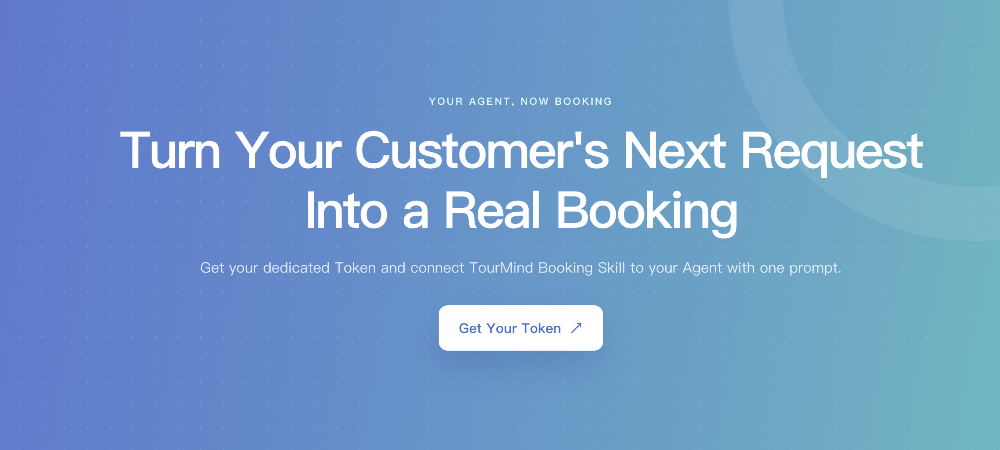

<div align="center">

<h1 style="border-bottom: none">
  <b><a href="https://tourmind.com/skills">TourMind Booking Skills</a></b><br />
  <strong>Let Your Agent Book Hotels Worldwide</strong>
</h1>

<a href="https://tourmind.com/user/skill-token">
  
</a>

<br />

<p align="center">
  Bring Your Customers Into Intelligent Travel
</p>

<br />

<div align="center">
  <a href="https://tourmind.com/skills">Product Page</a> |
  <span>Live Demo</span> |
  <a href="https://tourmind.com">Company</a>
</div>

<br />

[](https://clawhub.ai/tourmind/skills/hotel-booking-ai)
[](https://github.com/tourmind-com/Tourmind-Booking-Skills/releases/latest)
[](LICENSE)

</div>

<br />

<div align="center">
  <a href="README.md">English</a> |
  <a href="README.zh-CN.md">简体中文</a> |
  <a href="README.ja.md">日本語</a> |
  <a href="README.es.md">Español</a>
</div>

<br />

Turn any AI agent into an end-to-end hotel booking assistant—search global inventory, compare live rates across leading OTAs and hotel suppliers, verify availability, and complete booking, payment, cancellation, and order management in one conversation with TourMind.

## Core capabilities

- Resolve cities, hotels, landmarks, stations, addresses, ski areas, and other POIs without inventing coordinates.
- Search up to 20 hotel candidates, query matching live room products, and select the five best verified options.
- Compare live nightly and stay-total rates across leading OTAs and hotel suppliers, including cancellation and inventory status.
- Return hotel and room images, facilities, beds, meals, fees, and evidence-based match reasons.
- Recheck the selected room's price and availability before booking.
- Create bookings, query and cancel orders, and start Stripe, WeChat Pay, or Alipay payments.
- Provide expiring, repeatable, read-only result links without exposing the Skill Token.

## Supported AI clients

| Client | Support |
|---|---|
| WorkBuddy | Install or import this repository as a user Skill |
| OpenAI Codex | Install from the Skills interface or a supported local skills directory |
| Claude Code | Install as a personal Skill under `~/.claude/skills` |
| Agent Skills-compatible clients | Compatible when the client can load a root `SKILL.md` and make outbound HTTPS `POST` requests |
| MCP-capable AI clients | Use the companion [TourMind Booking MCP](https://github.com/tourmind-com/Tourmind-Booking-MCP) package |

## Install in 1 minute

1. Sign in to your TourMind account, then create a Skill Token at [tourmind.com/user/skill-token](https://tourmind.com/user/skill-token). If you do not have an account, register for a business account at [Business account registration](https://tourmind.com/admin/skillSignup). Developers and individual users should use the TourMind Skill version intended for their user type instead.

2. In your AI client's Skills interface, install or import this GitHub repository:

   ```text
   https://github.com/tourmind-com/Tourmind-Booking-Skills.git
   ```

   If your client installs Skills from the filesystem, clone the repository into its personal skills directory:

   ```bash
   CLIENT_SKILLS_DIR="<your-client-skills-directory>"
   mkdir -p "$CLIENT_SKILLS_DIR"
   git clone https://github.com/tourmind-com/Tourmind-Booking-Skills.git "$CLIENT_SKILLS_DIR/tourmind-booking"
   ```

   Common personal Skill locations:

   | Client | Directory |
   |---|---|
   | WorkBuddy | `~/.workbuddy/skills` |
   | OpenAI Codex | Use the Skills interface or the local directory supported by your Codex version |
   | Claude Code | `~/.claude/skills` |

3. In the installed `tourmind-booking` folder, create `skill_token.txt` and paste only the raw Token into it. On macOS or Linux, restrict access:

   ```bash
   chmod 600 skill_token.txt
   ```

Reload Skills or restart the AI client, then ask for a hotel. No local MCP server is required; this Skill calls the TourMind API directly over HTTPS.

Never commit `skill_token.txt`. It is excluded by `.gitignore`.

## Example prompts

These examples combine the agent's own research and itinerary-planning abilities with TourMind's live hotel search, rate verification, booking, payment, and order-management workflow.

```text
I’m planning a four-night trip for two to Osaka (Japan) from April 9 to April 13, 2027, flying in and out of Kansai International Airport. We want one or two days of sea fishing around Osaka Bay or Awaji Island and will not rent a car. First use your own web research and itinerary-planning abilities to compare practical fishing areas, seasonal considerations, licensed charter options, and public-transport times, then propose a relaxed day-by-day itinerary. For the best base, use TourMind to search live hotel inventory. Keep the average room price under JPY 18,000 per night; prefer a twin room near a station, practical early-morning transport to the fishing meeting point, free cancellation, and breakfast when it fits the departure time. Show the five best verified options with room photos, total stay price and currency, taxes and fees when returned, cancellation terms, breakfast, the transfer plan to the fishing point, key trade-offs, and a repeatable result link. Do not book yet.
```

```text
Plan a six-night ski trip to the Dolomites (Italy) for two adults from February 6 to February 12, 2027. We will arrive at Venice Marco Polo Airport, will not drive, and are intermediate skiers. First compare Cortina d’Ampezzo, Val Gardena, and Alta Badia for airport transfers, ski terrain, dining, and value, then recommend the best base and a realistic day-by-day plan. Use TourMind to find available hotels averaging no more than EUR 250 per night, preferably within a 10-minute walk or shuttle ride of a lift, with ski storage, breakfast, free cancellation, and a sauna if possible. Return the five best verified live options with room and bed type, photos, nightly and stay-total prices, cancellation deadlines, meals, inventory status, distance to the lift, and any constraint each option misses. After I choose one, recheck its live price and availability, summarize the exact final amount and policy, and wait for my explicit confirmation before booking or starting payment.
```

```text
Use the second hotel from the comparison. Show the hotel details and every currently bookable room product that fits two adults, including room photos, bed type, meals, cancellation policy, on-request status, nightly price, and total price. Recommend the best-value rate and explain why. Then recheck that exact rate. If anything changed, show the old and new values clearly; otherwise give me the final booking summary and ask for confirmation. Do not create the booking or payment until I explicitly say “confirm booking.”
```

```text
Look up my booking using agent reference ID <AGENT_REF_ID>. Explain the current booking and payment status in plain language. If it is cancellable, show the cancellation deadline, penalty, and expected refundable amount before doing anything. Cancel only after I explicitly confirm, then query the booking again and show the final status. Never expose my Skill Token in the response or result link.
```

## Workflow

```text
Location or POI
  → search_location
  → search_hotels (up to 20 candidates)
  → query_room_rates (live products for eligible candidates)
  → rank and present the five best verified hotels
  → get_hotel_detail + room images and quotes
  → check_room_availability for the selected rate
  → create_booking after explicit confirmation
  → pay_order / query_booking / cancel_booking as requested
```

Cached `search_hotels.min_price` is only a candidate signal. User-visible prices come from `query_room_rates`, and the final booking uses the latest values returned by `check_room_availability`.

## Token and security

- All ToB Skill API calls require the Skill Token stored locally in `skill_token.txt`.
- Keep the token out of prompts, logs, screenshots, URLs, commits, and issue reports.
- Restrict the token file to the current user with `chmod 600`.
- On HTTP 401 or an `unauthorized` response, remove the invalid local token. To replace it, sign in to your TourMind account and create a Skill Token at [tourmind.com/user/skill-token](https://tourmind.com/user/skill-token). If you do not have an account, register for a business account at [Business account registration](https://tourmind.com/admin/skillSignup). Developers and individual users should use the Skill version intended for their user type.
- Result `web_url` sessions are read-only and can be opened repeatedly until they expire; they cannot verify rates, book, pay, cancel, or access account and finance pages.
- Booking, cancellation, and payment remain explicit user-confirmed actions inside the authenticated AI conversation.

## Choose the right TourMind integration

| Audience | Integration | Authentication model | Repository |
|---|---|---|---|
| Consumer / ToC | Direct HTTP Skill | Public search and availability; `user_key` only for order operations | [Hotel Booking AI](https://github.com/tourmind-com/Hotel-Booking-AI) |
| Business / ToB | Direct HTTP Skill | Skill Token required for every API call | **[TourMind Booking Skill](https://github.com/tourmind-com/Tourmind-Booking-Skills)** |
| Consumer / ToC | MCP package + companion Skill | Public MCP connection; `user_key` only for order operations | [Hotel Booking AI MCP](https://github.com/tourmind-com/Hotel-Booking-AI-MCP) |
| Business / ToB | MCP package + companion Skill | Bearer-authenticated MCP connection | [TourMind Booking MCP](https://github.com/tourmind-com/Tourmind-Booking-MCP) |

## API and support

**API base URL:** `https://api.tourmind.com`

| Endpoint | Purpose |
|---|---|
| `POST /skill/tob/check_skill_update` | Check for a Skill update |
| `POST /skill/tob/search_location` | Resolve a region, POI, or hotel |
| `POST /skill/tob/search_hotels` | Search hotel candidates |
| `POST /skill/tob/get_hotel_detail` | Get hotel details and images |
| `POST /skill/tob/query_room_rates` | Get live rooms and rates |
| `POST /skill/tob/check_room_availability` | Recheck the selected rate and inventory |
| `POST /skill/tob/create_booking` | Create a confirmed booking |
| `POST /skill/tob/query_booking` | Query an order |
| `POST /skill/tob/cancel_booking` | Cancel an order after confirmation |
| `POST /skill/tob/pay_order` | Start payment after confirmation |

- Request fields and response contracts: [references/parameter_guide.md](references/parameter_guide.md)
- Skill Token: sign in, then visit [tourmind.com/user/skill-token](https://tourmind.com/user/skill-token). If you do not have an account, register for a business account at [Business account registration](https://tourmind.com/admin/skillSignup). Developers and individual users should use the Skill version intended for their user type.
- Product page: [tourmind.com/skills](https://tourmind.com/skills)
- GitHub support: [open an issue](https://github.com/tourmind-com/Tourmind-Booking-Skills/issues)
- Hotel business inquiry: `hotel@tourmind.com`
- Business cooperation: `bp@tourmind.com`

## License

[MIT](LICENSE) © 2026 TourMind
